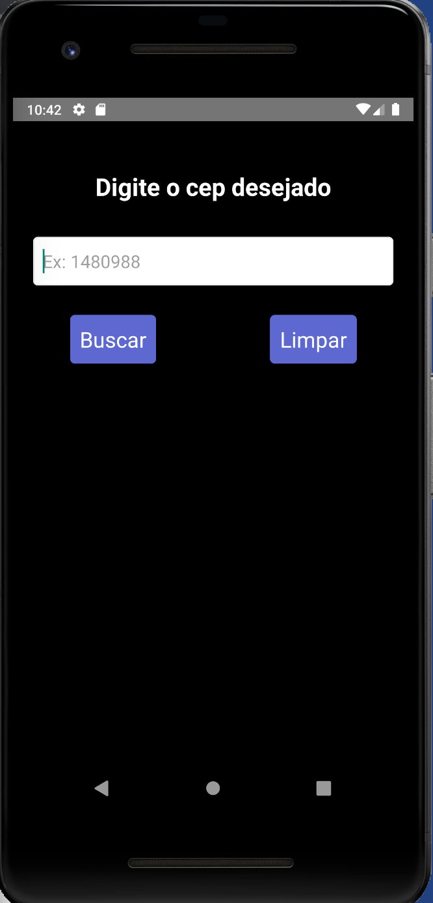
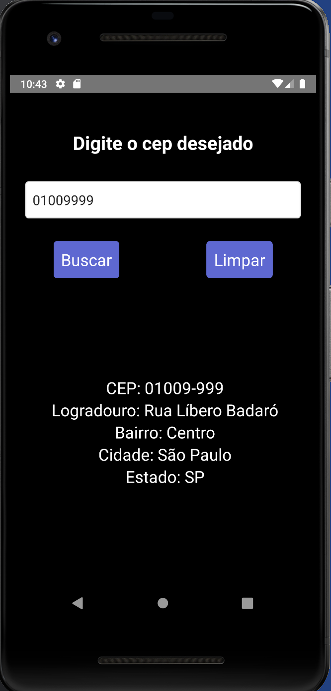

# App Buscador de CEP

## Sobre

Aplicativo criado com React Native, utilizando:
- Api pública via cep
- Hooks (UseState e UseRef)
- Axios
- React Native CLI
- Emulador Android Studio
- IDE: Visual Studio Code

## App:

### - Tela inicial onde você pode pesquisar por qualquer cep valido

### - Exemplo onde pesquisei um cep e retornou as informações como cep, logradouro, bairro, cidade e estado na tela.

